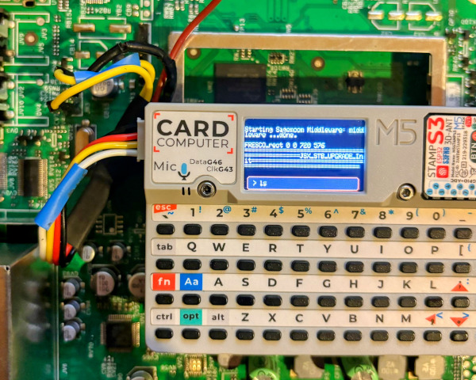
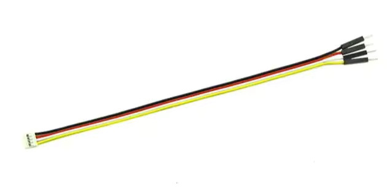

# MicroCOM

Microcom is a lightweight serial UART communication software for the M5Cardputer. This allows users to configure and manage serial communication with external devices over UART.

## Features:
- Easy configuration for baud rate, data bits, parity, stop bits, flow control, and inverted signal settings.
- Send and receive serial data

## Installation
- <b>M5Burner</b> : Search into M5CARDPUTER section and simply burn it
- <b>Github</b> : Get the firmware from the latest github release.

## Pin Configuration:
The pins used are on the Grove connector:

- <b>RX Pin:</b> GPIO1 (can be changed in the configuration menu)
- <b>TX Pin:</b> GPIO2 (can be changed in the configuration menu)

You could use Grove/Dupont connector to interface with the Cardputer:

## Keybinds:

- <b>Config</b>: Use `Arrows` and `OK` button to toggle configuration options.
- <b>Terminal</b>: Use `Keys` and `OK` button to send commands

## ⚠️ Caution:

The M5Cardputer operate at 3.3V logic levels. Connecting any UART device that uses a different voltage can damage the device. Always ensure that your connected UART device that uses 3.3V.